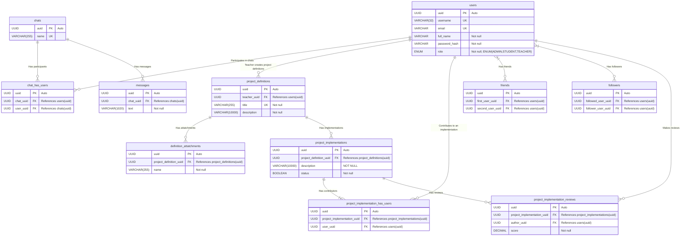

# Database (ER) diagram 

```mermaid
erDiagram
    users ||--o{ chat_has_users: "Participates in chats"
    chats ||--o{ chat_has_users: "Has participants"
    chats ||--o{ messages: "Has messages"

    users ||--o{ project_definitions: "Teacher creates project definitions"
    project_definitions ||--o{ definition_attatchments: "Has attatchments"

    project_definitions ||--o{ project_implementations: "Has implementations"
    project_implementations ||--|{ project_implementation_has_users: "Has contributors"
    users ||--o{ project_implementation_has_users: "Contributes to an implementation"

    users }|--o{ friends: "Has friends"
    users }|--o{ followers: "Has followers"

    project_implementations ||--o{ project_implementation_reviews: "Has reviews"
    users ||--o{ project_implementation_reviews: "Makes reviews"

    users {
        UUID uuid PK "Auto"
        VARCHAR(32) username UK    
        VARCHAR email UK
        VARCHAR full_name "Not null" 
        VARCHAR password_hash "Not null"
        ENUM role "Not null; ENUM{ADMIN,STUDENT,TEACHER}" 
    }

    chats {
        UUID uuid PK "Auto"
        VARCHAR(255) name UK
    }

    chat_has_users {
        UUID uuid PK "Auto"
        UUID chat_uuid FK "References users(uuid)"
        UUID user_uuid FK "References chats(uuid)"
    }

    messages {
        UUID uuid PK "Auto"
        UUID chat_uuid FK "References chats(uuid)"
        VARCHAR(1020) text "Not null"
    }

    project_definitions {
        UUID uuid PK "Auto"
        UUID teacher_uuid FK "References users(uuid)"
        VARCHAR(255) title UK "Not null"
        VARCHAR(10000) description "Not null"
    }

    definition_attatchments {
        UUID uuid PK "Auto"
        UUID project_definition_uuid FK "References project_definitions(uuid)"
        VARCHAR(255) name "Not null"
    }

    project_implementations {
        UUID uuid PK "Auto"
        UUID project_definition_uuid FK "References project_definitions(uuid)"
        VARCHAR(10000) description "NOT NULL"
        BOOLEAN status "Not null"
    }

    project_implementation_has_users {
        UUID uuid PK "Auto"
        UUID project_implementation_uuid FK "References project_implementations(uuid)"
        UUID user_uuid FK "References users(uuid)"
    }

    followers {
        UUID uuid PK "Auto"
        UUID followed_user_uuid FK "References users(uuid)"
        UUID follower_user_uuid FK "References users(uuid)"
    }

    friends {
        UUID uuid PK "Auto"
        UUID first_user_uuid FK "References users(uuid)"
        UUID second_user_uuid FK "References users(uuid)"
    }

    project_implementation_reviews {
        UUID uuid PK "Auto"
        UUID project_implementation_uuid FK "References project_implementations(uuid)"
        UUID author_uuid FK "References users(uuid)"
        DECIMAL score "Not null"
    } 
```